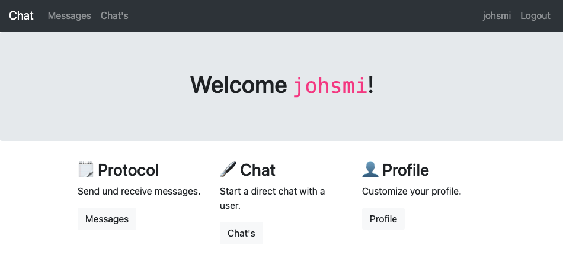

# ✉️ Chat

#### Send and receive messages like a usual messenger

This is just a little school project, it is **not production ready** or finished in general.



---

## Features

- **Register** (register as a user)
- **Login** (login as a user)


- **Protocol** (protocol is ur in/outbox for messages, download messages)
- **Chat** (write messages in one to one design like most messengers)

## Tech Stack

The application is built with `PHP` as front- and backend. `MySQL` is used to store userdata and the messages.

## Installation

1. **Clone the project**
   
   ```sh
    git clone https://github.com/jannesrudnick/chatty
    cd chatty
   ```

2. **Edit environment variables**
   
   Duplicate the `env.example.php` file, and save as `env.php` like:

   ```php
   $_ENV["db_host"] = "localhost";
   $_ENV["db_user"] = "user";
   $_ENV["db_password"] = "secretpasswort";
   $_ENV["db_name"] = "database";
   ```

3. **Setup MySQL**
   
   Import the `database.sql` for example with `phpMyAdmin` to create the tables.

4. **Serve php App**
   
   Serve `chatty` for example with `mamp` on macOS or `xampp` on Windows. 